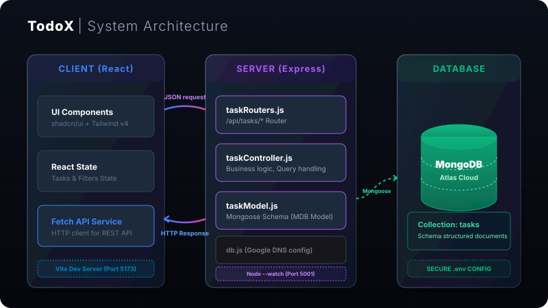
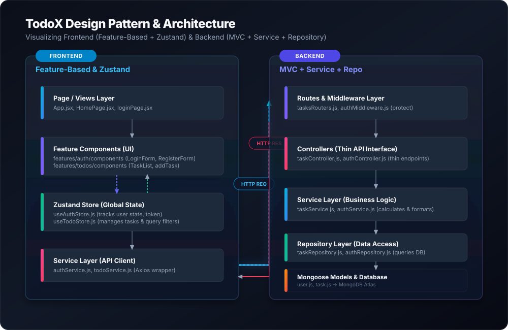

# TodoX — Fullstack MERN 2026
 
<div align="center">
 
[](https://www.mongodb.com/)
[](https://expressjs.com/)
[](https://react.dev/)
[](https://nodejs.org/)
[](https://tailwindcss.com/)
[](https://zustand-demo.pmnd.rs/)
 
[](https://github.com/vtgh04/TodoX/stargazers)
[](https://github.com/vtgh04/TodoX/network/members)
[](LICENSE)
 
**TodoX** is a modern, high-performance, full-stack Task & Workflow Management web application designed with clean architecture, professional engineering practices, and strict business specification compliance. Featuring a glassmorphic user interface, timezone-safe date queries, a persistent dual-language context, a strict state machine workflow, offline synchronization queues, and high test coverage.
 
[Demo Application](http://localhost:5001) · [Report Bug](https://github.com/vtgh04/TodoX/issues) · [Request Feature](https://github.com/vtgh04/TodoX/issues)
 
</div>
 
---
 
## 📖 Table of Contents
 
- [🏗️ System Architecture](#️-system-architecture)
- [⚡ Core Features](#-core-features)
- [🧩 Design Patterns & SOLID](#-design-patterns--solid)
- [🛠️ Tech Stack & Decisions](#️-tech-stack--decisions)
- [📂 Project Directory Structure](#-project-directory-structure)
- [🚀 Getting Started](#-getting-started)
- [🧪 Running Tests](#-running-tests)
- [🔌 API Reference](#-api-reference)
- [🤝 Contributing Guide](#-contributing-guide)
- [📄 License](#-license)
 
---
 
## 🏗️ System Architecture
 
TodoX leverages a decoupled Client-Server architecture, ensuring optimal separation of concerns:
 

 
* **Vite API Reverse Proxy:** The frontend dev server utilizes a custom reverse proxy to direct `/api` calls to port `5001`. This eliminates CORS preflight overhead locally while preserving clean relative endpoints in the React codebase.
* **Separation of Layers:** 
  * **Frontend:** Refactored into a **Feature-Based Architecture**. Key business capabilities (like Auth, Todos) own their local UI components, state stores (Zustand), and Axios integrations.
  * **Backend:** Leverages an evolved **MVC pattern** with distinct Service and Repository layers to decouple network protocols, business decisions, and database operations.
* **Fail-Safe Startup:** Port binding occurs immediately on launch to keep the dev server proxy stable. Database connection attempts run asynchronously and report faults gracefully instead of force-crashing the process.
 
---
 
## ⚡ Core Features
 
* **🔐 Full Authentication & Session Management:** Dynamic login, registration, and forget/reset password pipelines protected with securely signed JSON Web Tokens (JWT) stored in HTTP-Only cookies. Powered by the frontend Zustand `useAuthStore`.
* **🔄 Task Lifecycle & State Machine:** Tasks follow a strict lifecycle workflow: `TODO` <-> `IN_PROGRESS` <-> `UNDER_REVIEW` -> `COMPLETED`. Unauthorized direct state jumps are validation-blocked on both the client and server.
* **🎯 Focus Rule (Single Active Task):** Only one task can be `IN_PROGRESS` per user to encourage deep focus. Activating a task automatically pauses the previously running one (Auto-Pauses it back to `TODO`).
* **📶 Offline Synchronization Queue:** Optimistic client-side state updates. When offline, user actions are stored in a persistent queue in LocalStorage and cards display a "Pending Sync" badge. Reconnecting to the network triggers an automatic background sync.
* **🎨 Dual View Modes (List & Kanban Board):** Instant hotkey-supported switcher between a list view and a 4-column drag-and-drop Kanban Board View.
* **🚀 Instant Client-Side Filtering & Search:** Real-time search query and priority level filter `<50ms` using Zustand reactive selectors.
* **🏷️ Task Priority Levels:** Low, Medium, and High priority configurations (defaulting to Medium) represented with sleek, distinct glassmorphic badges.
* **🌐 Persistent Dual-Language Context:** Fast switching between Vietnamese (🇻🇳) and English (🇺🇸) with immediate translation of dynamic counters, inputs, tooltips, and system notifications. Choices persist across reloads via `localStorage`.
 
---
 
## 🧩 Design Patterns &amp; SOLID
 
TodoX incorporates industry-standard architectural and structural design patterns to maintain high code scalability and readability.
 

 
### Applied Design Patterns
*   **Service & Repository Pattern (Backend):**
    *   *Service Layer:* Business logic is abstracted out of controllers into services (e.g., `authService`, `taskService`), ensuring the Single Responsibility Principle.
    *   *Repository Pattern:* Database queries (Mongoose) are isolated into repositories (e.g., `authRepository`, `taskRepository`), keeping services agnostic of the database implementation.
*   **Feature-Based Architecture (Frontend):**
    *   Code is organized by feature modules (e.g., `features/auth`, `features/todos`) rather than generic technical roles. Each feature encapsulates its own `components`, API `services`, and state `store`.
*   **State Management (Frontend):**
    *   Global state is managed via **Zustand** (`useAuthStore` and `useTodoStore`), replacing standard React Context for better performance, local indexing, and a predictable data flow.
*   **Singleton Pattern (Creational):**
    *   *Frontend:* Decouples Axios into a unified client instance at `frontend/src/lib/axios.js`. All API calls share this single instance instead of instantiating new request handlers.
    *   *Backend:* Mongoose connection pool acts as a globally cached singleton instance in `backend/src/config/db.js`, sharing database connection handshakes across routes.
*   **Chain of Responsibility Pattern (Behavioral):**
    *   Implemented via Express HTTP middleware stack (`express.json()`, custom CORS, and route handlers) in `server.js`. Requests pass sequentially through checkpoints; each block executes a single concern and hands control over via `next()`.
 
### SOLID Principles
*   **Single Responsibility Principle (SRP):**
    *   Every module maintains a single axis of change. Backend is decoupled into `models/`, `routes/`, `controllers/`, `services/`, `repositories/`, and `config/`. Frontend encapsulates logic into features.
 
---
 
## 🛠️ Tech Stack & Decisions
 
### Frontend
* **React 19 & Lucide Icons:** Single-page rendering, state hooks, and crisp SVG visual cues.
* **Tailwind CSS v4 & custom UI primitives:** Native CSS variables, fast build compilation, and rich glassmorphism styles.
* **Zustand:** Lightweight, hook-based global state management with offline persistence wrappers.
* **Axios Instance:** Centralized config with base URLs adapted automatically to the host environment.
 
### Backend
* **Node.js (v24.x) & Express:** Asynchronous execution using native ES Modules (`import/export`).
* **Mongoose & MongoDB Atlas:** Object document mapping, strict status enum constraints, and automated date timestamps.
* **Google DNS Override:** Fallback resolver configuration (`8.8.8.8`) inside the DB setup block to bypass local ISP blocks on MongoDB Atlas SRV addresses.
 
---
 
## 📂 Project Directory Structure
 
```text
TodoX/
├── doc/
│   ├── SVG/
│   │   ├── banner.svg              # Marketing Banner
│   │   ├── architecture.svg        # System Architecture Diagram
│   │   └── design_patterns.svg     # Design Patterns Flow Diagram
│   └── TodoX_BA_Specification.md  # Core Product Specification Documentation
├── backend/
│   ├── src/
│   │   ├── config/
│   │   │   └── db.js               # MongoDB connection & Google DNS setup
│   │   ├── repositories/
│   │   │   ├── authRepository.js   # DB transactions for authentication
│   │   │   └── taskRepository.js   # DB queries for todo tasks
│   │   ├── services/
│   │   │   ├── authService.js      # Business rules for login/register/reset
│   │   │   └── taskService.js      # Filtering, state validation, and Auto-Pause
│   │   ├── controllers/
│   │   │   ├── authController.js   # Thin route endpoints for authentication
│   │   │   └── taskController.js   # Thin route endpoints for tasks
│   │   ├── model/
│   │   │   ├── user.js             # Mongoose User Schema
│   │   │   └── task.js             # Mongoose Task Schema with priority & workflow status
│   │   ├── middleware/
│   │   │   └── authMiddleware.js   # Protect/Me verify JWT cookie middleware
│   │   ├── routes/
│   │   │   ├── authRouters.js      # Express routers for auth
│   │   │   └── tasksRouters.js     # Express routers for tasks
│   │   └── server.js               # Express server configuration
│   ├── tests/
│   │   ├── authController.test.js  # Controller unit tests using mock repositories
│   │   └── taskController.test.js  # Task state machine & Auto-Pause unit tests
│   ├── .env                        # Local database credentials (ignored)
│   └── package.json                # Server scripts, Vitest dependencies & coverage config
└── frontend/
    ├── src/
    │   ├── features/
    │   │   ├── auth/
    │   │   │   ├── services/
    │   │   │   │   └── authService.js # API call wrappers for Auth
    │   │   │   └── store/
    │   │   │       └── useAuthStore.js # Zustand Auth state store
    │   │   └── todos/
    │   │       ├── components/     # Feature components (BoardView, taskList, addTask)
    │   │       │   ├── BoardView.jsx  # Drag and drop Kanban Board View
    │   │       │   ├── addTask.jsx    # Add task with priority & keyboard shortcuts
    │   │       │   ├── taskList.jsx   # List View with transition controls
    │   │       │   ├── StatsAndFilters.jsx # Filtering tabs & metrics badges
    │   │       │   ├── TaskListPagination.jsx # Page controller
    │   │       │   └── DateTimeFilter.jsx  # Customized calendar filter
    │   │       └── store/
    │   │           └── useTodoStore.js # Zustand Todo state store with offline sync queue
    │   ├── components/
    │   │   ├── Header.jsx          # Header with localized subtitle
    │   │   ├── ProtectedRoute.jsx  # Protect wrapper for routes
    │   │   ├── footer.jsx          # Footer with stats
    │   │   └── LanguageSwitcher.jsx # Floating bilingual switcher
    │   ├── context/
    │   │   └── AuthContext.jsx     # Legacy provider wrapping Zustand useAuthStore
    │   ├── lib/
    │   │   ├── axios.js            # Unified Axios instance
    │   │   └── data.js             # Filter constants
    │   ├── pages/
    │   │   ├── HomePage.jsx        # Root dashboard with view togglers & search filters
    │   │   └── loginPage.jsx       # Multi-form Authentication portal
    │   └── App.jsx                 # Entry routing
    └── vite.config.js              # Vite server & proxy configurations
```
 
---
 
## 🚀 Getting Started
 
### Prerequisites
* **Node.js** (v20+ recommended)
* **NPM** (v10+)
* A running **MongoDB Atlas** cluster
 
### Installation & Quick Start
 
1. **Clone the repository:**
   ```bash
   git clone https://github.com/vtgh04/TodoX.git
   cd TodoX
   ```
 
2. **Backend Configuration:**
   Create a `.env` file in the `backend/` directory:
   ```env
   ConnectionStringMongodb="mongodb+srv://<username>:<password_url_encoded>@<cluster>.mongodb.net/<db_name>?appName=Cluster0"
   PORT=5001
   JWT_SECRET="YourSuperSecretJWTKey"
   ```
   > [!IMPORTANT]
   > If your Atlas password contains special characters (like `@`), you **must** URL-encode them (e.g. replace `@` with `%40`) inside the connection string to avoid driver connection errors.
 
3. **Install Dependencies and Pre-compile Assets:**
   Run the master installation script at the root directory:
   ```bash
   npm run build
   ```
 
4. **Launch the Unified Platform:**
   Start the Express server hosting both the REST API and the compiled React assets:
   ```bash
   npm run start
   ```
   Open `http://localhost:5001` in your browser.
 
---
 
## 🧪 Running Tests
 
We use **Vitest** and **Supertest** for testing backend controllers with fully mocked repository layers to achieve high code reliability.
 
To install test dependencies, run backend tests, and inspect code coverage, execute the following commands:
 
```bash
# Install test dependencies in backend
npm install --prefix backend

# Run the unit test suite
npm run test --prefix backend

# Run test coverage analysis (>80% required for business controllers)
npm run test:coverage --prefix backend
```
 
---
 
## 🔌 API Reference
 
All requests and responses use JSON formatting.
 
### 🔐 Authentication API (`/api/auth`)
 
| Method | Endpoint | Description | Request Body | Response Code |
| :--- | :--- | :--- | :--- | :--- |
| **POST** | `/api/auth/register` | Register a new user & set JWT in cookie | `{ "username": "...", "email": "...", "password": "..." }` | `210 Created` |
| **POST** | `/api/auth/login` | Log in user & set JWT in cookie | `{ "identifier": "...", "password": "..." }` | `200 OK` |
| **POST** | `/api/auth/logout` | Clear user session cookie (Requires Auth) | None | `200 OK` / `401 Unauthorized` |
| **GET** | `/api/auth/me` | Fetch currently authenticated user (Requires Auth) | None | `200 OK` / `401 Unauthorized` |
| **POST** | `/api/auth/forgot-password` | Generate reset token in logs | `{ "email": "..." }` | `200 OK` / `404 Not Found` |
| **POST** | `/api/auth/reset-password/:token` | Reset password using token | `{ "password": "..." }` | `200 OK` / `400 Bad Request` |
 
### 📅 Tasks API (`/api/tasks` - Requires Authentication)
 
| Method | Endpoint | Description | Request Body | Response Code |
| :--- | :--- | :--- | :--- | :--- |
| **GET** | `/api/tasks` | Retrieve paginated tasks & statistics for active user | None | `200 OK` |
| **POST** | `/api/tasks` | Create a task (starts in `TODO` status, default `Medium` priority) | `{ "title": "String", "priority": "Low/Medium/High" }` | `210 Created` / `400 Bad Request` |
| **PUT** | `/api/tasks/:id` | Update task fields (title, priority, status) | `{ "title": "...", "status": "TODO/IN_PROGRESS/UNDER_REVIEW/COMPLETED", "priority": "Low/Medium/High" }` | `200 OK` / `400 Bad Request` / `404 Not Found` |
| **DELETE** | `/api/tasks/:id` | Delete user task | None | `200 OK` / `404 Not Found` |
 
---
 
## 🤝 Contributing Guide
 
We welcome contributions! Please refer to standard fork-and-pull-request workflows on GitHub. Ensure that tests pass (`npm run test --prefix backend`) before submitting code changes.
 
---
 
## 📄 License
 
Distributed under the MIT License. See [LICENSE](LICENSE) for more details.