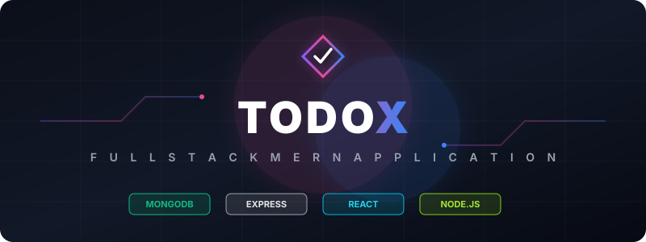

# TodoX — Fullstack MERN 2025: React + Node + MongoDB + Tailwind 4 + Shadcn



**TodoX** is a modern, high-performance, fullstack Todo application built to demonstrate professional engineering standards. By leveraging the **MERN Stack (MongoDB, Express, React, Node.js)**, the application integrates a sleek, responsive, and responsive dark-mode styling utilizing **Tailwind CSS v4** and customized interactive elements, backed by a robust and resilient RESTful API featuring timezone-safe database filtering, custom CORS handling, and pagination.

---

## 🏗️ System Architecture & Data Flow

TodoX follows a clean separation of concerns, decoupling the frontend Single Page Application (SPA) from the stateless REST API. 


### Key Architectural Decisions:
* **Vite API Proxying:** During development, the frontend dev server proxies `/api` requests to port `5001`. This bypasses browser cross-origin limits locally without exposing the backend directly, matching standard microservice architectures.
* **MVC-Lite Controller Pattern:** The backend decouples HTTP routing from database operations. Controllers isolate the Mongoose schema actions, making route mappings declarative and clean.
* **Resilient Startup & Keep-Alive:** Unlike standard configurations where database connection failures crash the server process via `process.exit(1)`, TodoX binds the Express port immediately on launch. Database connection errors are captured asynchronously and logged with troubleshooting instructions, ensuring development file-watchers (`--watch`) remain alive.

---

## ⚡ Core Engineering Features

### 1. Timezone-Safe Date Query Engine (UTC+7)
MongoDB stores all date structures in UTC. When querying tasks created on a specific calendar day in Vietnam (UTC+7), a naive UTC query leads to date shifting (tasks appearing on the wrong day). TodoX isolates date ranges on the backend controller by manually mapping dates relative to the UTC+7 offset:
* **Custom Date Filter:** Computes bounds between `YYYY-MM-DDT00:00:00.000+07:00` and `YYYY-MM-DDT23:59:59.999+07:00` in UTC, ensuring tasks created within the local Vietnamese day match perfectly.
* **Today's Filter:** Shifts the server's current timestamp to UTC+7 before computing the boundaries of "today" dynamically.

### 2. Cross-Browser Native DatePicker Activation
Triggering native date picker dialogs programmatically can fail or behave inconsistently across desktop browsers (like Chrome/Edge) and mobile platforms (Safari/iOS). TodoX solves this with a clean UI overlay design:
* An invisible `<input type="date">` (`opacity-0 cursor-pointer absolute inset-0`) overlays the custom Lucide-react `Calendar` icon button.
* When the user clicks the icon button, they interact directly with the transparent input.
* An `onClick` handler calls the native `showPicker()` API wrapped in a fail-safe try-catch, guaranteeing the picker pop-up displays instantly across all modern web environments.

### 3. Persistent Bilingual Context (VI/EN)
A custom, state-controlled language switcher card is fixed at the top-right corner of the viewport.
* Supports instantaneous toggle between Tiếng Việt (🇻🇳) and English (🇺🇸).
* Component states (headers, forms, status badges, placeholders, and dynamic footer status messages) are localized immediately upon toggle.
* Language preference is synchronized and stored in `localStorage` (`todo_lang`), maintaining the state across page reloads.

### 4. Native CORS & Resilient Connection
* **Zero-Dependency CORS:** Uses a native custom CORS middleware in Express to intercept preflight `OPTIONS` requests and authorize origin headers without pulling in heavy third-party NPM packages.
* **Google DNS Fallback:** Sets node's DNS resolution servers to Google (`8.8.8.8`) inside the database config block, resolving potential Atlas connection drops (`ECONNREFUSED`) caused by specific ISP blocks on MongoDB SRV records.

---

## 🛠️ Technology Stack

### Backend
* **Node.js (v24.x):** Fast execution environment utilizing native ES Modules and modern `--watch` file monitoring.
* **Express.js (v4.18.x):** Fast, minimalist web framework for REST API routing and middleware management.
* **Mongoose (v9.x):** Schema definition, strict typing, and validation.
* **Dotenv:** Strict separation of environment configurations from source code.

### Frontend
* **React.js (v19.x):** Modern component lifecycle management and hooks.
* **Tailwind CSS v4:** Modern utility-first styling utilizing HSL CSS variable palettes and custom animations.
* **Lucide React:** Premium modern iconography.

---

## 📂 Project Directory Structure

```text
TodoX/
├── doc/
│   └── SVG/
│       ├── banner.svg              # SVG Marketing Banner
│       └── architecture.svg        # SVG System Architecture Diagram
├── backend/
│   ├── src/
│   │   ├── config/
│   │   │   └── db.js               # MongoDB connection and Google DNS setup
│   │   ├── controllers/
│   │   │   └── taskController.js   # REST API Controllers (CRUD + Filtering)
│   │   ├── model/
│   │   │   └── task.js             # Mongoose Schema (ACTIVE/COMPLETED status)
│   │   ├── routes/
│   │   │   └── tasksRouters.js     # REST Routing declarations
│   │   └── server.js               # Entry point of the Express server
│   ├── .env                        # Local secrets configuration (Ignored)
│   ├── .gitignore                  # Git ignore rules for node_modules and env
│   └── package.json                # Server scripts and dependencies
└── frontend/                       # React Client Codebase
    ├── src/
    │   ├── components/
    │   │   ├── ui/                 # Reusable UI component blocks
    │   │   ├── Header.jsx          # Header with localized subtitle
    │   │   ├── addTask.jsx         # Task creation form
    │   │   ├── StatsAndFilters.jsx # Filter state toggles & stats
    │   │   ├── taskList.jsx        # Localized list renderer
    │   │   ├── TaskListPagination.jsx # Page change component
    │   │   ├── DateTimeFilter.jsx  # Customized calendar filter
    │   │   └── LanguageSwitcher.jsx # Bilingual trigger card
    │   ├── lib/
    │   │   ├── axios.js            # Unified Axios instance
    │   │   ├── data.js             # Local static configuration
    │   │   └── utils.js            # UI style mergers
    │   ├── pages/
    │   │   └── HomePage.jsx        # Primary page controller
    │   ├── App.jsx                 # Client entry point
    │   └── main.jsx                # React DOM renderer
    ├── vite.config.js              # Vite bundler configuration (Proxy settings)
    └── package.json                # Frontend build commands
```

---

## 🚀 Getting Started

### Prerequisites
* **Node.js** (v20+ recommended)
* **NPM** (v10+)
* **MongoDB Atlas** database URI

---

### Installation & Run

1. **Clone the repository:**
   ```bash
   git clone https://github.com/vtgh04/TodoX.git
   cd TodoX
   ```

2. **Backend Configuration:**
   Create a `.env` file in the `backend/` directory:
   ```env
   ConnectionStringMongodb="mongodb+srv://<username>:<password_url_encoded>@<cluster>.mongodb.net/<db_name>?appName=Cluster0"
   PORT=5001
   ```
   > [!IMPORTANT]
   > If your Atlas password contains special characters (e.g., `@`), URL-encode them (e.g., replace `@` with `%40`) to prevent parsing errors inside the connection driver.

3. **Build the Application:**
   Run the master build script from the root directory to configure all dependencies and pre-compile the frontend client:
   ```bash
   npm run build
   ```

4. **Start the Production Servers:**
   Launch the unified backend hosting environment:
   ```bash
   npm run start
   ```
   The application will serve the built client bundle and backend API unified at `http://localhost:5001`.

---

## 🔌 API Reference

The backend communicates strictly in JSON format. The base URL is `/api/tasks`.

| Method | Endpoint | Description | Request Body | Response Code |
| :--- | :--- | :--- | :--- | :--- |
| **GET** | `/api/tasks` | Fetch tasks matching parameters (pagination, status, date) | None | `200 OK` |
| **POST** | `/api/tasks` | Insert a new task | `{ "title": "String" }` | `201 Created` |
| **PUT** | `/api/tasks/:id` | Update task title, status, or completedAt | `{ "title": "String", "status": "ACTIVE/COMPLETED", "completedAt": Date }` | `200 OK` |
| **DELETE** | `/api/tasks/:id` | Purge a task from the database | None | `200 OK` |

### Database Schema Specification (`Task`)

```typescript
{
  title: {
    type: String,
    required: true,
    trim: true
  },
  status: {
    type: String,
    enum: ['ACTIVE', 'COMPLETED'],
    default: 'ACTIVE'
  },
  completedAt: {
    type: Date,
    default: null
  },
  createdAt: Date, // Auto-generated timestamp
  updatedAt: Date  // Auto-generated timestamp
}
```