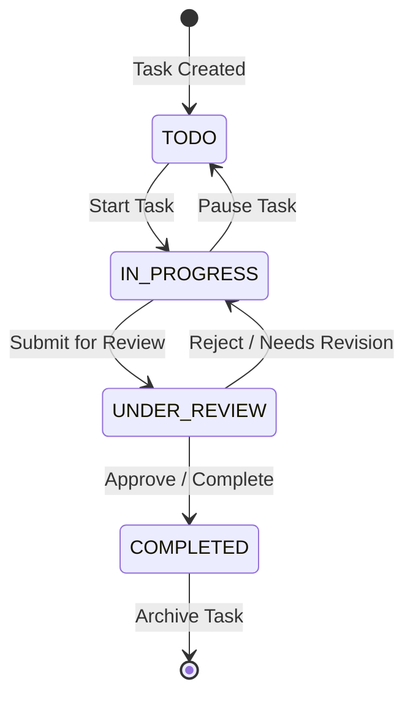

# TodoX — Task & Workflow Management System
## Product Specification & Requirement Documentation (PRD)
**Role:** Business Analyst / Product Owner  
**Target Audience:** Development Team / AI Coding Assistants  

---

## 1. Product Vision & Value Proposition
TodoX is a modern, high-performance Task & Workflow Management web application designed to help individuals and small teams streamline their daily activities. The product solves the pain points of fragmented workflows, lack of task state visibility, and slow UI updates by offering a real-time, responsive, and intuitive task board.

### Key Goals:
* **Workflow Visibility:** Provide clear visualization of task progress through defined stages.
* **Frictionless UX:** Ensure instant feedback and state updates using client-side state synchronization (Zustand).
* **Robust Data Decoupling:** Build a clean, decoupled backend architecture (Repository Pattern) to support rapid business logic iteration.

---

## 2. Target User Personas
### Persona A: "The Focused Builder" (Individual Contributor)
* **Goal:** Wants to quickly capture ideas, plan their day, and update task progress without lag or complicated setup.
* **Pain Points:** Clunky interfaces, slow page reloads, and rigid task structures.

### Persona B: "The Project Facilitator" (Team Lead / Collaborator)
* **Goal:** Needs to assign tasks, monitor overall board health, and verify completed work before archiving.
* **Pain Points:** Double-handling of tasks, lack of real-time sync when multiple people view the same list.

---

## 3. Task Workflow & State Machine
Every task in TodoX follows a structured lifecycle to ensure process integrity. Below is the workflow state machine:

### State Definitions & Rules:
1. **TODO:** The task is in the backlog, ready to be started.
2. **IN_PROGRESS:** The assignee is actively working on the task. Only one task should be marked as active per user to encourage focus.
3. **UNDER_REVIEW:** The task is completed by the worker and awaits validation. Prevents unauthorized self-completion of critical team tasks.
4. **COMPLETED:** The task has met all acceptance criteria.

---

## 4. Product Backlog (Epics & User Stories)

### Epic 1: Task Lifecycle Management
#### User Story TDX-101: Create and Define Tasks
* **As a** TodoX User,
* **I want to** create a new task with a title, description, and priority level,
* **So that** I can document and categorize my upcoming work.

##### Acceptance Criteria (AC):
* **AC 1 (Validation):** The task title must not be empty and must be under 100 characters.
* **AC 2 (Defaults):** By default, a newly created task starts in the `TODO` state and is set to `Medium` priority unless specified otherwise.
* **AC 3 (UX):** The input form must support keyboard shortcuts (e.g., `Ctrl + Enter` to submit).

#### User Story TDX-102: Transition Task States
* **As a** Task Owner,
* **I want to** drag and drop or click to transition a task to the next state,
* **So that** my team has real-time visibility into my work status.

##### Acceptance Criteria (AC):
* **AC 1 (State Validity):** Task transitions must strictly follow the state machine (e.g., a task cannot jump from `TODO` to `COMPLETED` without going through `IN_PROGRESS` and `UNDER_REVIEW` if review is enabled).
* **AC 2 (Responsiveness):** The UI must transition the task instantly on the client side, then sync with the database in the background.

---

### Epic 2: Real-time State Synchronization
#### User Story TDX-201: Client-Side State Management (Zustand)
* **As a** User,
* **I want** the application state to be managed efficiently on the client side,
* **So that** filtering, searching, and updating tasks feel instantaneous without server roundtrip delay.

##### Acceptance Criteria (AC):
* **AC 1 (Latency):** Filtering tasks by search query or priority must take less than 50ms on the client.
* **AC 2 (Offline Indicator):** If the server sync fails, the UI must show a "Pending Sync" badge on the affected task, retaining the user's changes locally.

---

### Epic 3: Architectural Decoupling (Repository Pattern)
#### User Story TDX-301: Business Logic Separation
* **As a** Product Owner,
* **I want** the system database operations to be decoupled from the API controllers via the Repository Pattern,
* **So that** we can easily change our database provider (e.g., MongoDB to PostgreSQL) in the future without rewritten business logic.

##### Acceptance Criteria (AC):
* **AC 1 (Decoupling):** Controllers must only call Repository interfaces. No direct database queries (e.g., Mongoose `find()`, `save()`) are allowed inside the controllers.
* **AC 2 (Testability):** The API must achieve >80% code coverage on business controllers using mock repositories.

---

## 5. Non-Functional Requirements (NFRs)
1. **Performance (Response Time):** 95% of API read operations must respond in under 150ms.
2. **Device Compatibility:** The task board layout must adapt dynamically to desktop, tablet, and mobile viewport sizes.
3. **Data Integrity:** In-progress state updates must be synchronized atomically to prevent concurrent overwrite conflicts.

---

## 6. User Acceptance Testing (UAT) Checklist
| Test Case ID | Test Scenario | Expected Result | Status |
|---|---|---|---|
| **UAT-TDX-01** | Create a task with invalid empty title | Form validation triggers, showing "Title is required" error. Task not saved. | `Pending` |
| **UAT-TDX-02** | Move task from `TODO` to `IN_PROGRESS` | Task state changes in UI immediately; API updates task state to `IN_PROGRESS` in DB. | `Pending` |
| **UAT-TDX-03** | Disconnect internet and update task | Task shows "Pending Sync" icon. Reconnecting internet automatically triggers background sync. | `Pending` |
| **UAT-TDX-04** | Verify state consistency across views | Switching between "List View" and "Board View" displays the exact same task states (Zustand store parity). | `Pending` |
